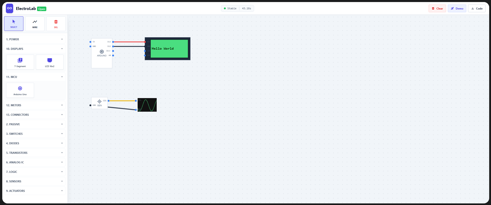

# ⚡ ElectroLab Open

A modern, interactive, browser-based electronics simulator built with **HTML5 Canvas**, **TailwindCSS**, and a fully custom **real-time circuit solver**.  
ElectroLab aims to provide a clean, intuitive interface suitable for learning electronics, prototyping circuits, and experimenting with microcontrollers — all running **client-side with no backend**.

---

## 📸 Demo

---

## 🚀 Features

### 🎛 Interactive Circuit Building
- Drag-and-drop components  
- Snap-to-grid canvas  
- Visual pins and color-coded wiring  
- Real-time measurement updates  
- Smooth pan-free editing area with infinite canvas feel

### 🔌 Power Components
- DC Battery (AA / 9V)
- Variable DC supply
- AC supply (sine)
- Solar cell
- Function generator

### 🎚 Passive Components
- Resistor  
- Potentiometer  
- Capacitor  
- Inductor  
- Thermistor  
- LDR

### 🎛 Switches & Relays
- SPST switch  
- Push button  
- Relay (SPDT)

### 📡 Diodes & Rectifiers
- Diode  
- LED  
- RGB LED  
- Bridge rectifier  

### ⚙ Transistors
- NPN BJT  
- N-MOSFET  

### 🔩 Analog ICs
- Op-Amp (741)  
- 7805 regulator  

### 🔢 Digital & Logic
- AND gate  
- NOT gate  
- 555 Timer  

### 🔍 Sensors
- Ultrasonic sensor  

### 🌀 Actuators
- DC Motor  
- Servo motor  
- Piezo buzzer  

### 🖥 Displays
- 7-segment display  
- LCD 16×2 (I²C-style simplified)

### 🧠 Microcontroller
- Arduino UNO (abstract pins)

### 🔎 Measurement Tools
- Voltmeter  
- Oscilloscope (live waveform rendering)

### 🛠 Connectors
- Ground  
- VCC node

---

## 🧩 Simulation Engine

ElectroLab includes a custom lightweight solver:

- Node-based Union-Find engine  
- Relaxation voltage solver (iterative)  
- Real-time AC waveform generation  
- Component-specific state engines:
